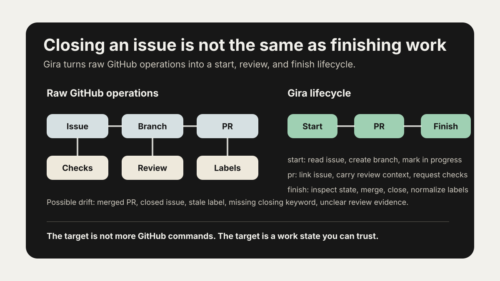
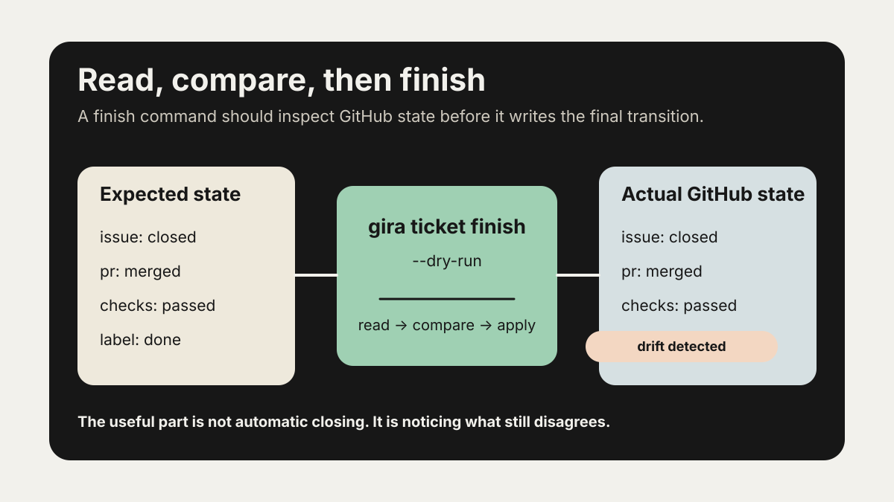

Gira는 처음부터 AI 에이전트를 위해 만든 도구가 아니었다.

시작은 더 작고 현실적인 불편이었다. GitHub에는 이미 issue, branch, pull request, review, checks, label, milestone, project가 있다. `gh cli`를 쓰면 대부분의 조작도 터미널에서 할 수 있다. 그런데 실제로 일을 하다 보면 작업 상태는 쉽게 흐트러진다.

이슈는 닫혔는데 라벨은 아직 `status:in-progress`일 수 있다. PR은 머지됐는데 원래 이슈와의 연결이 약할 수 있다. 체크는 통과했지만 리뷰에서 무엇을 확인했는지 남지 않을 수 있다. 프로젝트 보드는 업데이트됐지만 실제 PR 상태와 맞지 않을 수 있다.

문제는 GitHub에 기능이 없다는 것이 아니다. 기능은 충분히 있다. 문제는 그 기능들이 "이 일이 시작됐고, 검토됐고, 끝났다"는 하나의 흐름으로 항상 정리되지는 않는다는 점이다.

그래서 이 글의 중심은 AI coding agent가 아니다. 중심은 더 기본적인 문장이다.

> 이슈를 닫는 것과 일을 끝내는 것은 다르다.

{fig-alt="GitHub 조작과 Gira 작업 생명주기를 비교한 다이어그램"}

## GitHub에는 기능이 많지만 일이 저절로 정리되지는 않는다

GitHub에서 소프트웨어 작업은 여러 조각으로 흩어진다.

- 문제나 요구사항은 issue에 있다.
- 구현은 branch와 commit에 있다.
- 논의와 검토는 pull request에 있다.
- 자동 검증은 checks에 있다.
- 작업 상태는 label이나 project field에 있다.
- 일정이나 묶음은 milestone에 있다.

각각은 좋은 기능이다. GitHub의 pull request는 단순한 diff가 아니라 conversation, commits, checks, review, files changed가 모이는 협업 단위다. issue와 PR은 closing keyword나 수동 연결로 이어질 수 있고, default branch로 머지되면 연결된 issue가 자동으로 닫힐 수도 있다.

하지만 여기에는 빈틈이 있다.

GitHub는 조각들을 제공한다. 그 조각들을 어떤 순서로 읽고, 언제 어떤 상태를 바꾸고, 마지막에 무엇을 확인할지는 작업자가 정해야 한다.

작업자가 한 명일 때는 기억으로 버틸 수 있다. 이 이슈에서 브랜치를 만들었고, 이 PR이 그 이슈를 해결했고, 리뷰는 내가 봤고, 체크는 통과했고, 라벨은 나중에 정리해야 한다는 것을 머릿속으로 알고 있다.

하지만 일이 반복되면 기억은 작업 흐름이 되지 못한다. 이슈가 늘어나고, PR이 늘어나고, 중간에 다른 작업자가 들어오고, 자동화가 섞이면 작은 누락이 쌓인다.

Gira를 만들면서 실제로 본 문제도 그랬다. 닫힌 이슈에 활성 상태 라벨이 남아 있었다. 코드는 반영됐고 PR은 머지됐고 이슈도 닫혔지만, 레포지토리의 상태 표시는 아직 일이 진행 중이라고 말하고 있었다.

코드 변경은 끝났는데 작업 상태는 끝나지 않은 것이다.

## `gh cli`는 좋은 조작 도구다

여기서 `gh cli`를 낮게 볼 필요는 없다. 오히려 반대다. `gh`는 GitHub를 터미널에서 다루는 좋은 도구다.

`gh issue create`로 이슈를 만들 수 있다. `gh pr create`로 PR을 열 수 있다. `gh pr checks`로 체크 상태를 볼 수 있고, `gh pr review`로 리뷰를 남길 수 있고, `gh pr merge`로 머지할 수 있다.

문제는 명령의 존재가 아니다.

문제는 사람이 매번 흐름을 기억해야 한다는 점이다.

```text
일반적인 gh 중심 흐름

1. issue를 만든다
2. label을 붙인다
3. branch를 만든다
4. commit한다
5. PR을 만든다
6. PR body에 closing keyword가 있는지 확인한다
7. check가 끝났는지 본다
8. review를 남기거나 받는다
9. PR을 merge한다
10. issue가 닫혔는지 확인한다
11. label, project, milestone 상태를 정리한다
```

이 흐름은 전부 `gh`와 `git`으로 할 수 있다. 하지만 "할 수 있다"와 "항상 같은 기준으로 끝난다"는 다르다.

Gira가 다루려는 것은 GitHub 조작 자체가 아니다. Gira가 다루려는 것은 작업 상태다.

```text
gira ticket start
  - 이슈 상태를 확인한다
  - 브랜치를 만든다
  - 작업 상태를 진행 중으로 바꾼다

gira ticket pr
  - PR을 만든다
  - 이슈 연결을 확인한다
  - 리뷰 기준을 남긴다
  - 작업 상태를 리뷰 중으로 바꾼다

gira ticket finish
  - PR, check, review, issue, label 상태를 읽는다
  - 실제 상태와 기대 상태를 비교한다
  - 빠진 마무리 작업을 처리하거나 멈춘다
```

명령을 줄이는 것이 핵심은 아니다. 사람이 매번 기억하던 작업 순서를 도구가 검사 가능한 흐름으로 만드는 것이 핵심이다.

## Jira로 옮기고 싶지는 않았다

Jira가 잘하는 것이 있다. 작업 상태를 명시적으로 다룬다.

작업에는 상태가 있고, 상태 사이에는 전환이 있다. To Do, In Progress, In Review, Done 같은 상태가 있고, 팀은 그 상태를 기준으로 보드를 보고 흐름을 관리한다.

이 장점은 인정해야 한다. 일이 커질수록 "지금 이 작업이 어디에 있는가"는 코드 diff만큼 중요해진다.

하지만 모든 작업 상태를 Jira로 옮기고 싶지는 않았다. 코드와 PR과 리뷰와 체크는 이미 GitHub에 있다. 개발자의 실제 작업도 GitHub에서 일어난다. 그렇다면 작업 상태를 보기 위해 다시 다른 시스템으로 이동하는 것이 항상 좋은 답은 아닐 수 있다.

Gira의 문제의식은 여기서 나온다.

GitHub를 Jira처럼 더 잘 쓰고 싶다. 하지만 작업의 기준점을 GitHub 밖으로 빼고 싶지는 않다.

그래서 Gira는 GitHub를 대체하지 않는다. GitHub 위에 얇은 작업 흐름을 얹는다. issue, branch, PR, review, checks, label, close를 하나의 작업 생명주기로 읽으려는 시도다.

## Terraform에서 빌려온 감각

Gira를 설명할 때 Terraform을 떠올리게 된다. 물론 Gira는 Terraform이 아니다. GitHub 작업과 인프라 관리는 전혀 다른 문제다.

그래도 유용한 사고방식이 있다.

Terraform은 실제 인프라와 설정 파일 사이의 관계를 state로 관리한다. `terraform plan`은 현재 상태를 읽고, 원하는 상태와 비교하고, 적용할 변경을 보여준다. `apply`는 그 계획을 실제로 반영한다. drift detection은 실제 세계가 기대 상태와 어긋났는지 찾아낸다.

GitHub 작업에도 비슷한 감각이 필요하다.

이 이슈는 어떤 PR과 연결되어 있어야 하는가. 그 PR은 머지됐는가. 체크는 통과했는가. 이슈는 닫혔는가. 닫혔다면 활성 상태 라벨은 제거됐는가. 프로젝트 상태는 끝난 상태와 맞는가.

`gira ticket finish --dry-run`이 하고 싶은 일은 거창하지 않다. 지금 이 이슈와 PR이 정말 끝낼 수 있는 상태인지 먼저 읽고, 부족한 상태 전환이 무엇인지 보여주는 것이다.

{fig-alt="Gira가 기대 상태와 실제 GitHub 상태를 비교하는 흐름"}

바로 닫지 않는다. 먼저 읽는다. 비교한다. 그리고 적용한다.

이 차이가 중요하다.

## 리뷰는 diff만 보는 일이 아니다

PR 리뷰를 "변경된 파일을 보는 일"로만 생각하면 작업 흐름의 절반을 놓친다.

좋은 리뷰는 원래 이슈로 돌아간다.

이 작업은 왜 시작됐는가. 어떤 문제를 해결하려 했는가. PR 설명은 그 문제와 연결되어 있는가. 체크는 어떤 범위를 검증했는가. 리뷰어는 무엇을 확인했고 무엇을 보류했는가. 머지 후에 남은 작업은 없는가.

코드 diff는 중요하다. 하지만 diff만으로는 일이 끝났는지 알 수 없다.

예를 들어 테스트가 통과했다는 것은 좋은 신호다. 하지만 테스트가 원래 이슈의 요구를 모두 검증한다는 뜻은 아니다. PR이 머지됐다는 것은 코드가 들어갔다는 뜻이다. 하지만 라벨, 프로젝트 상태, 릴리즈 노트, 후속 작업까지 정리됐다는 뜻은 아니다.

이슈가 닫혔다는 것도 마찬가지다. 닫힘은 신호 하나다. 일이 끝났다는 증거 전체는 아니다.

Gira의 `finish`는 이 지점을 다루려고 한다. 단순히 PR을 머지하는 것이 아니라, 관련된 작업 상태가 서로 맞는지 확인하려는 것이다.

## 에이전트 이야기는 그 다음이다

AI coding agent 이야기를 완전히 빼기는 어렵다. Copilot coding agent, Codex, SWE-agent 같은 흐름은 issue를 입력으로 받고, 코드를 수정하고, PR을 만드는 방향으로 가고 있다.

하지만 Gira의 출발점을 agent로 설명하면 순서가 틀린다.

문제는 agent가 일을 못 끝낸다는 것이 아니다. 사람도 상태 정리를 놓친다. agent는 그 문제를 더 빠르고 자주 드러낼 뿐이다.

사람이 혼자 처리할 때는 "아, 이건 끝난 거야"라고 맥락으로 넘어갈 수 있다. 다음 사람이 들어오면 조금 어려워진다. agent가 들어오면 더 어려워진다. agent는 label, issue state, PR state, check result 같은 명시적인 신호를 보고 다음 행동을 결정하기 때문이다.

닫힌 이슈에 `status:in-review`가 남아 있다면 다음 작업자는 대충 의도를 추측할 수 있다. 하지만 도구나 agent에게는 그 상태가 애매하다.

리뷰해야 하는가. finish해야 하는가. 이미 끝난 것으로 봐야 하는가. label을 믿어야 하는가, closed state를 믿어야 하는가.

그래서 좋은 에이전트를 만들기 전에, 먼저 좋은 작업 흐름이 필요하다.

사람과 agent가 같은 기준으로 일을 시작하고, PR을 만들고, 리뷰를 받고, 체크를 확인하고, 끝낼 수 있어야 한다. 그 기준이 없으면 agent는 더 많은 PR을 만들 수는 있어도, 레포지토리의 작업 상태를 더 신뢰하기 어렵게 만들 수 있다.

## Gira가 남기고 싶은 기록

Gira가 남기고 싶은 기록은 단순하다.

- 이 일은 어떤 이슈에서 시작됐는가
- 어떤 브랜치에서 작업했는가
- 어떤 PR로 리뷰됐는가
- PR은 어떤 이슈를 닫는가
- 어떤 체크가 실행됐는가
- 리뷰에서 무엇을 확인했는가
- 머지됐는가, 보류됐는가, 닫혔는가
- 마무리 후 라벨과 프로젝트 상태는 실제 결과와 맞는가

이 기록이 있으면 사람이 보기도 좋고, 나중에 agent가 이어받기도 좋다.

작업 기록은 보고용 장식이 아니다. 다음 작업의 입력이다.

## 닫힌 이슈보다 중요한 것

이슈를 닫는 것은 필요하다. 하지만 충분하지는 않다.

일을 끝낸다는 것은 원래 문제, PR, 리뷰, 체크, 라벨, 프로젝트 상태가 서로 모순되지 않는다는 뜻에 가깝다. 적어도 다음 사람이 봤을 때 "이 작업은 왜 시작됐고, 무엇으로 해결됐고, 어떤 기준으로 끝났는가"를 따라갈 수 있어야 한다.

Gira가 하려는 일은 GitHub 밖에 또 다른 작업 관리 시스템을 세우는 것이 아니다. 이미 GitHub 안에 있는 기능들을 일의 시작과 마무리라는 흐름으로 묶는 것이다.

`gh cli`는 GitHub를 조작하는 좋은 도구다. Gira는 그 조작들이 작업 상태로 이어지도록 만들고 싶다.

이슈는 닫을 수 있다. 하지만 일은 증거와 상태가 함께 맞을 때 끝난다.

## 참고 자료

- Gira repository: https://github.com/StatPan/gira
- GitHub pull request and issue linking: https://docs.github.com/en/issues/tracking-your-work-with-issues/using-issues/linking-a-pull-request-to-an-issue
- GitHub pull requests: https://docs.github.com/articles/using-pull-requests
- GitHub status checks: https://docs.github.com/articles/about-statuses
- GitHub CLI reference: https://docs.github.com/en/github-cli/github-cli/github-cli-reference
- Jira workflow overview: https://www.atlassian.com/software/jira/guides/workflows/overview
- Terraform state: https://developer.hashicorp.com/terraform/language/state
- Terraform plan: https://developer.hashicorp.com/terraform/cli/commands/plan
- GitHub Copilot coding agent: https://docs.github.com/en/copilot/how-tos/use-copilot-agents/coding-agent/create-a-pr
- OpenAI Codex overview: https://platform.openai.com/docs/codex/overview
- SWE-agent: https://arxiv.org/abs/2405.15793
